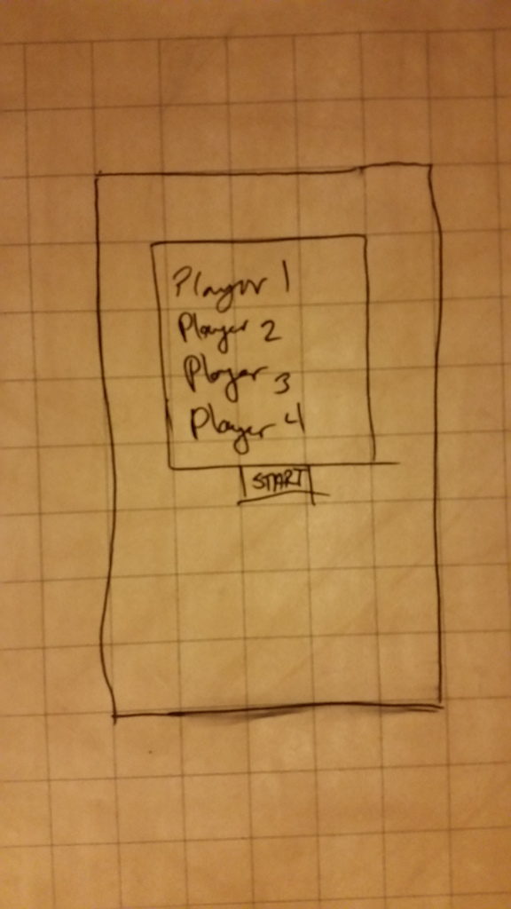
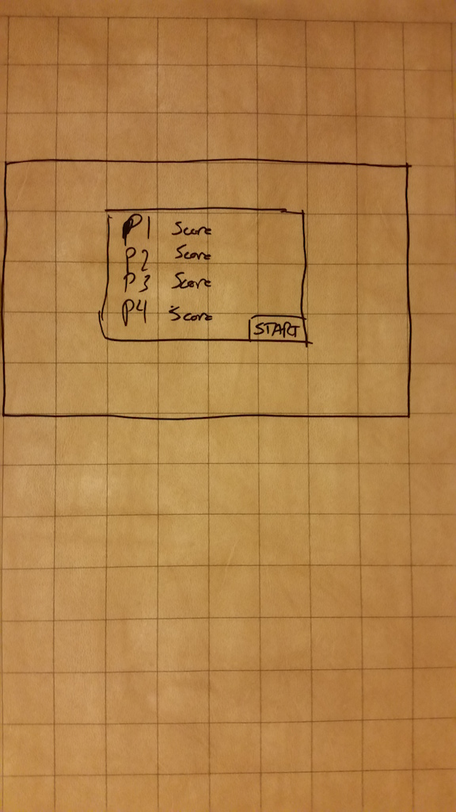

Game - until a player reaches 100 points  
Round - a dealing of 52 cards  
Turn - a cycle where each player plays 1 card  

############### FEATURE LIST / USER STORIES <<<<<<<<

Have the game deal 13 random cards to each player with no duplicates.

Have the ability to play with 3 'computer'/'A.I.' opponents.

Sort dealt cards by suit and value (2 -> Ace).

Allow playing across multiple devices(?).

Have the ability to "shoot the moon" when all hearts and Queen of Spades is held by a single player.

Only allows playing of cards which would be "legal moves", based on the opening card played each round.

If current player holds no cards of current suit, allow them to 'dump' cards.

Tracks the score of all players through multiple rounds until one or more player(s) breaks 100 points.

Display each player's current score between and during a round.

Start each round by "exchanging" 3 cards with another opponent.

Play always begins with the "2 of Clubs".

Hearts cannot be lead with until the suit is broken.

"Breaking the suit" of hearts cannot be done on the first turn in a round.

Winner of the highest "starting suit" wins a turn.

Allow the players to set their name before a game starts.

Allow the player to leave and come back to a game (versus A.I.) where they left off.

